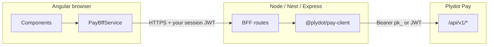

# Integration guide

> **Canonical docs:** [API Specification handbook](../../handbook/plydot-pay-api-spec-v1.0.md) — Guide § Merchant integration.

Complete guide for third-party merchants using `@plydot/pay-client`.

---

## 1. Prerequisites

### Merchant setup (one-time, by Plydot admin)

1. Create merchant: `POST /v1/merchants` with `type: "MERCHANT"`.
2. Issue API key: `POST /v1/merchants/{id}/api-keys` — save the `rawKey` (shown once).
3. Register webhook: `POST /v1/webhooks/endpoints` with your HTTPS callback URL — save the `secret` (`whsec_…`).

Your integrator backend only needs the **API key** and **webhook secret**.

### What you build

- **Backend / BFF** — creates checkouts, initiates pay, handles webhooks
- **Frontend** (optional) — shows payment status; triggers pay via your BFF with customer phone number

---

## 2. Install the library

```bash
npm install @plydot/pay-client
```

Works in Node 18+, NestJS, Express, Angular SSR, and any environment with native `fetch`.

---

## 3. Configure the client

Create one shared instance (Nest provider, Express singleton, etc.):

```typescript
// pay.config.ts
import { PlydotPayClient } from '@plydot/pay-client'

export const payClient = PlydotPayClient.builder()
  .apiKey(process.env.PLYDOT_PAY_API_KEY!)
  .baseUrl(process.env.PLYDOT_PAY_BASE_URL ?? 'https://pay.plydot.dev')
  .build()
```

```bash
# .env (server only — never commit)
PLYDOT_PAY_API_KEY=pk_test_…
PLYDOT_PAY_BASE_URL=https://pay.plydot.dev
```

Never expose the API key to browsers or mobile apps. All Pay calls go through **your backend**.

---

## 4. Discover providers and payers

Before checkout, load assigned providers with nested payers:

```typescript
const providers = await payClient.listProviders()
// [{ code: "SANDBOX", providerId: "…", payers: [{ id, code: "MTN_MOMO", … }] }]

const sandbox = providers.find((p) => p.code === 'SANDBOX')!
const mtnPayer = sandbox.payers.find((p) => p.code === 'MTN_MOMO')!
```

Use `providerId` + `payerId` when creating the checkout. The rail is fixed for that checkout; pay only sends `payerRef` (MSISDN).

---

## 5. Create a checkout

When a customer starts checkout on your site, create a Pay checkout with **your product SKU** and the chosen provider/payer:

```typescript
import { ThirdPartyCheckoutRequest } from '@plydot/pay-client'

async function startCheckout(order: Order, providerId: string, payerId: string) {
  return payClient.createThirdPartyCheckout(
    ThirdPartyCheckoutRequest.builder()
      .productId(order.sku)
      .amountMinor(order.totalUgx)
      .currency('UGX')
      .providerId(providerId)
      .payerId(payerId)
      .customer({
        name: order.customerName,
        phone: order.customerPhone,
        email: order.customerEmail,
      })
      .description(order.description)
      .build(),
    `checkout-${order.id}`,
  )
}
```

**Response fields you care about:**

| Field | Value |
|-------|-------|
| `id` | Pay checkout UUID — use for `payCheckout` |
| `productId` | Your SKU echoed back |
| `amountMinor` | Charge amount |
| `status` | `PENDING` until paid |
| `expiresAt` | Checkout expiry — create a new one if expired |
| `accountRef` | Your merchant code (same for all your sales) |

---

## 6. Collect payment

When the customer enters their phone number, pay with `payerRef` only (provider and payer are already on the checkout):

```typescript
async function collectPayment(checkoutId: string, phone: string) {
  return payClient.payCheckout(checkoutId, { payerRef: phone })
}
```

The response includes `payment.instructions` — show these to the customer (e.g. "Approve the Mobile Money prompt on 256700000099").

Payment starts in `PENDING` or `PROCESSING`. Final state arrives via **webhook** or polling.

---

## 7. Handle webhooks (recommended)

Register `POST https://your-api.com/webhooks/plydot` in Pay.

### Express example

```typescript
import express from 'express'
import { parseWebhookEvent, WebhookVerifier } from '@plydot/pay-client'

const app = express()

app.post(
  '/webhooks/plydot',
  express.raw({ type: 'application/json' }),
  async (req, res) => {
    const rawBody = req.body.toString('utf8')
    const signature = req.header(WebhookVerifier.signatureHeaderName())

    if (!WebhookVerifier.verify(process.env.PLYDOT_WEBHOOK_SECRET!, rawBody, signature)) {
      return res.status(401).send('Invalid signature')
    }

    const event = parseWebhookEvent(rawBody)
    if (event.event === 'payment.succeeded') {
      await orderService.fulfill(event.data)
    }

    res.status(200).send('ok')
  },
)
```

**Important:** Verify against the **raw body** before `JSON.parse`. Do not use `express.json()` on the webhook route.

---

## 8. Poll payment status (optional)

Use as a fallback or for live UI updates:

```typescript
const payment = await payClient.getPayment(paymentId)
if (payment.status === 'SUCCEEDED') {
  await fulfillOrder(payment)
}
```

---

## 9. Angular / BFF integration

Angular apps must **not** call Plydot Pay directly with `pk_…` keys. Use a backend-for-frontend (BFF) pattern:



### Environment (server only)

```bash
PLYDOT_PAY_API_KEY=pk_live_…
PLYDOT_PAY_BASE_URL=https://pay.plydot.com/api
PLYDOT_WEBHOOK_SECRET=whsec_…
```

### NestJS BFF example

```typescript
// pay.module.ts
import { Module } from '@nestjs/common'
import { PlydotPayClient } from '@plydot/pay-client'

@Module({
  providers: [
    {
      provide: PlydotPayClient,
      useFactory: () =>
        PlydotPayClient.builder()
          .apiKey(process.env.PLYDOT_PAY_API_KEY!)
          .baseUrl(process.env.PLYDOT_PAY_BASE_URL!)
          .build(),
    },
  ],
  exports: [PlydotPayClient],
})
export class PayModule {}
```

```typescript
// checkout.controller.ts
@Controller('api/pay')
export class CheckoutController {
  constructor(private readonly pay: PlydotPayClient) {}

  @Post('checkouts')
  async createCheckout(@Body() body: CreateCheckoutDto) {
    const providers = await this.pay.listProviders()
    // … pick provider/payer from body or defaults
    return this.pay.createThirdPartyCheckout(/* … */)
  }

  @Post('checkouts/:id/pay')
  async pay(@Param('id') id: string, @Body() body: { phone: string }) {
    return this.pay.payCheckout(id, { payerRef: body.phone })
  }
}
```

### Angular frontend service

The browser calls **your** API, not Pay:

```typescript
// pay-bff.service.ts
@Injectable({ providedIn: 'root' })
export class PayBffService {
  constructor(private readonly http: HttpClient) {}

  createCheckout(order: Order) {
    return this.http.post<CreateCheckoutResponse>('/api/pay/checkouts', order)
  }

  payCheckout(checkoutId: string, phone: string) {
    return this.http.post(`/api/pay/checkouts/${checkoutId}/pay`, { phone })
  }
}
```

### Merchant admin JWT flows (settlements)

Settlement **submit** requires a merchant admin JWT, not the API key. Obtain the token on the server:

```typescript
const { accessToken } = await PlydotPayClient.obtainAccessToken(
  'merchant.admin',
  process.env.MERCHANT_ADMIN_PASSWORD!,
  { baseUrl: 'https://pay.plydot.com/api' },
)

const payout = await payClient.submitPayoutRequest({}, accessToken)
```

Optionally expose a short-lived session to Angular for admin UI flows — never expose the API key or webhook secret.

### Angular SSR webhook route

If using Angular SSR (or a hybrid app), register webhook verification on a **server route** only:

```typescript
// server.ts (Express adapter)
import { WebhookVerifier, parseWebhookEvent } from '@plydot/pay-client'

app.post('/webhooks/plydot', express.raw({ type: 'application/json' }), (req, res) => {
  const raw = req.body.toString('utf8')
  if (!WebhookVerifier.verify(process.env.PLYDOT_WEBHOOK_SECRET!, raw, req.header('X-Plydot-Signature'))) {
    return res.status(401).end()
  }
  const event = parseWebhookEvent(raw)
  // handle event…
  res.status(200).end()
})
```

---

## 10. Idempotency

Pass a stable `idempotencyKey` when creating checkouts (e.g. your order ID). Retries with the same key return the original checkout without double-charging.

---

## 11. Sandbox testing

1. Use `SANDBOX` provider from `listProviders()`.
2. After `payCheckout`, complete via Sandbox callback or the Pay Playground.
3. Use `pk_test_…` keys against `https://pay.plydot.dev` or local Docker.

---

## 12. Troubleshooting

| Problem | Fix |
|---------|-----|
| `UNAUTHORIZED` | Check API key; ensure `Authorization: Bearer pk_…` |
| `CUSTOMER_NAME_REQUIRED` | Use `ThirdPartyCheckoutRequest` with `customer.name` |
| `CHECKOUT_EXPIRED` | Create a new checkout |
| `PAYMENT_IN_PROGRESS` | Poll existing payment or wait for webhook |
| Webhook signature fails | Verify against raw body; check `whsec_` secret |
| Payment stays `PENDING` | Customer hasn't approved MoMo prompt yet |

---

## 13. Merchant settlement payouts

After live Yo payments succeed, merchants can request settlement (bank/MoMo payout). Plydot verifies each payment with Yo asynchronously, then ops completes the bank transfer.

### Auth

| Operation | Credential |
|-----------|------------|
| Balance, list/get payout, payout account | Merchant API key (`pk_…`) |
| Submit payout | **Merchant admin JWT** (`MERCHANT_ADMIN`) |

Obtain a JWT with `PlydotPayClient.obtainAccessToken` or your own Keycloak integration:

```typescript
const { accessToken } = await PlydotPayClient.obtainAccessToken(
  'merchant.admin',
  merchantAdminPassword,
  { baseUrl: 'https://pay.plydot.com/api' },
)
```

The Keycloak user must include merchant context (`merchant_code` or `merchant_id` attribute).

### Workflow (TypeScript)

```typescript
const pay = PlydotPayClient.builder()
  .apiKey('pk_live_…')
  .baseUrl('https://pay.plydot.com/api')
  .build()

const merchantId = '…' // your Pay merchant UUID
const { accessToken } = await PlydotPayClient.obtainAccessToken(
  'merchant.admin',
  process.env.MERCHANT_ADMIN_PASSWORD!,
  { baseUrl: 'https://pay.plydot.com/api' },
)

const settlements = pay.settlementWorkflow(accessToken, merchantId)

// 1. Check balance (live Yo-verified payments only; SANDBOX excluded)
const balance = await settlements.getBalance()
if (balance.availableMinor <= 0) throw new Error('Nothing to settle')

// 2. Confirm payout destination (configured by Plydot platform admin)
const account = await settlements.getPayoutAccount()

// 3. Submit payout — omit amount to settle full available balance
const payout = await settlements.submitFullBalance()
// status: PENDING_VERIFICATION → VERIFYING → VERIFIED | VERIFICATION_FAILED

// 4. Poll until Yo verification completes
const verified = await settlements.waitForPayout(payout.id)
if (verified.status === 'VERIFIED') {
  console.log(`Payout verified; Plydot ops will transfer ${verified.amountMinor} ${verified.currency}`)
} else if (verified.status === 'VERIFICATION_FAILED') {
  throw new Error(`Verification failed: ${verified.failureReason}`)
}
```

### Low-level API

```typescript
await pay.getSettlementBalance()
await pay.getPayoutAccount(merchantId)
await pay.submitPayoutRequest({ amountMinor: 50_000 }, accessToken)
await pay.getPayoutRequest(payoutId)
await pay.listPayoutRequests({ status: 'VERIFIED' })
await pay.waitForPayoutRequest(payoutId)
```

### Webhooks

| Event | When |
|-------|------|
| `settlement.verified` | All payout items passed Yo re-verification |
| `settlement.paid` | Platform marked bank transfer complete |

### Settlement troubleshooting

| Problem | Fix |
|---------|-----|
| `MERCHANT_CONTEXT_REQUIRED` | Set Keycloak `merchant_code` / `merchant_id`; fetch new JWT |
| Access denied on submit | Use merchant admin JWT, not API key |
| Stuck `PENDING_VERIFICATION` | Wait for async verify; ops can retry via admin API |
| `PAYOUT_ACCOUNT_NOT_FOUND` | Platform admin must configure payout account |
| `INSUFFICIENT_BALANCE` | No live Yo-verified balance (SANDBOX excluded) |

---

## 14. API docs

- Swagger UI: https://pay.plydot.com/api/swagger-ui.html
- Scalar docs: https://pay.plydot.com/api/docs/
- Playground: https://pay.plydot.com/api/playground/
- npm package: https://www.npmjs.com/package/@plydot/pay-client

For platform/admin APIs (merchant bootstrap, refund approval), use the REST API directly — they are not in this SDK v1.
